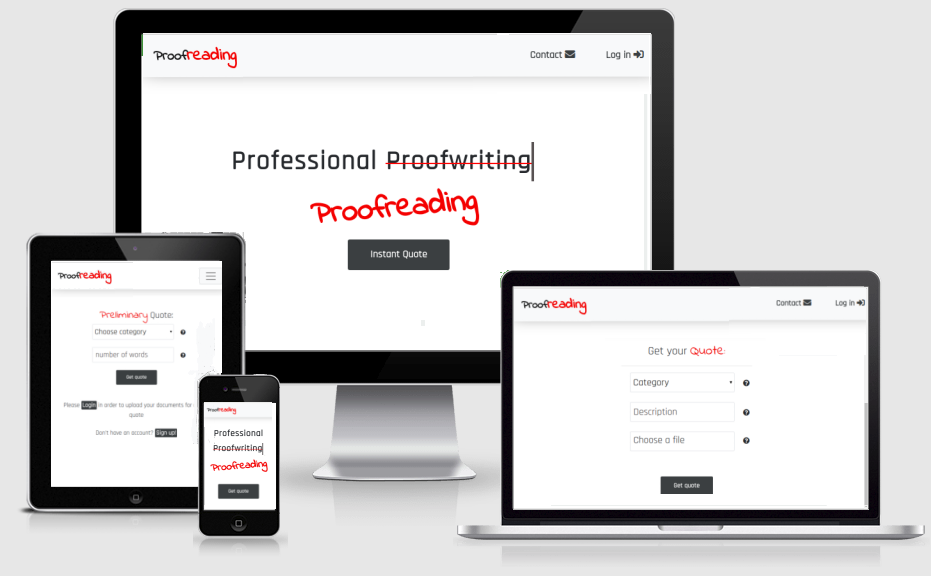

 # Proofread - Code Institute. Milestone 4
 

https://freelancer-ci.herokuapp.com/

### Table of contents:

- [Description](#Description)
- [UX](#UX)
    - [Business Goals](#Business-goals)
    - [User need](#User-needs)
- [Features](#Features)
 
- [Features Left to Implement](#Features-Left-to-Implement)
    
    ## Description
    
The Proofread project is focused on the freelance proofreader whose goal is to increase business value by closing the deals via the Internet. The project not only aims to create a hassle-free environment that would satisfy user needs, but also attempts to automate business processes, hence strives to improve business efficiency. Therefore, it takes shape of a complex website that consist of advanced features such as instant quotation, communication via the on-line chat and e-commerce functionality which concludes with the secure payments provided by Stripe. 
       
## UX

In order to build good UX it is necessary to identify business goals and to determine user needs. Therefore, this section gives an insight into the aforementioned aspects, which in turn helps to specify features for this project.

#### Business goals

* Improve business efficiency by providing instant on-line quotes.
* Allow self-service document upload and download.
* Provide e-commerce functionality.
* Enable communication via the on-line chat and email.

#### User needs

As a freelancer, I would like to:

* get notified about the new orders.
* be able to download documents for proofreading.
* be able to upload completed documents, so that a customer could access them. 
* get notified if a customer requests a change.   
* communicate with customer regarding their documents.

As a user who is looking to hire a proofreader, I want to:

* be able to obtain an instant quote, so I could get the price in immediately.
* contact someone, so I could ask questions such as turnaround times.
* get immediate answers to FAQ without having to contact anyone.
* know what others think about the service.

As a user who has obtained a quote I want to:

* proceed with the order and pay for the quote.
* add the quote to the basket and shop around.

As a user who has added the quote to the basket, I want to:

* proceed with the order and pay for the quote.
* remove the quote from the basket.
* get another quote.

As a user who has paid for the quote, I want to:

* get the confirmation of a successful transaction.
* see the status of my order such us whether the document is ready for download.
* download the document, if ready.
* request a change, if needed.
* communicate regarding the quote.
* get notified when the document is ready for download.

## Features

This section describes features that satisfy the requirements for the current version release. Also the section briefly outlines additional features for the subsequent versions of this project.

* **Quote page:**
       -**Preliminary quote** (logged-out users) is a web form that consists of two fields, namely Category and Word Count. If submitted, the form shows the price based on the information provided by the user, as shown in [Figure 1](freelancer_website/static/img/quote.png) Tool-tips, are also provided next to each form field, which on mouse-over displays an explanation.  Preliminary quote is enabled by the JavaScript at the front-end.

    - **Quote** (logged-in users) is a web form that consist of three fields, namely Category, Description and File Upload. The form if submitted, displays the add to basket button together with the price that is based on the chosen category and the uploaded document’s word count as shown in [Figure 2](freelancer_website/static/img/quote2.png). Quote is enabled by the back end code.
     
* **Basket**. Once a quote is added to the basket it appears in the customer’s basket page. Then the customer is given the options to remove the quote from the basket or to proceed to the checkout. The total price is also displayed as shown in Figure 4.
        
       
